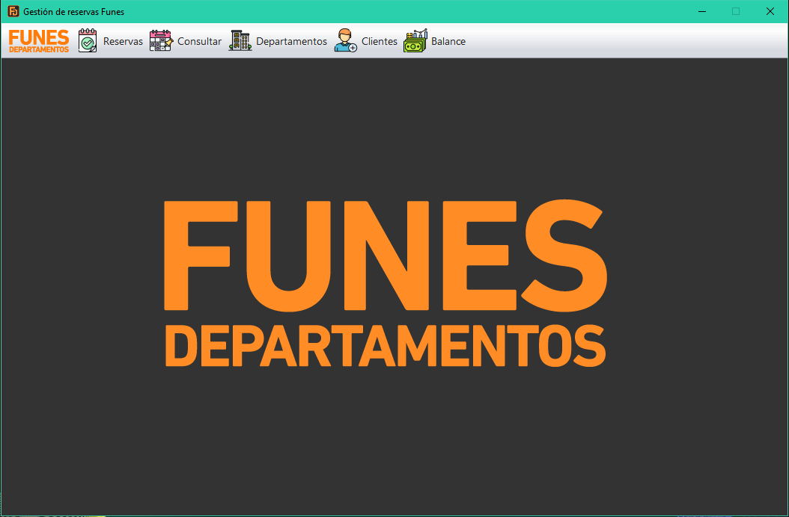
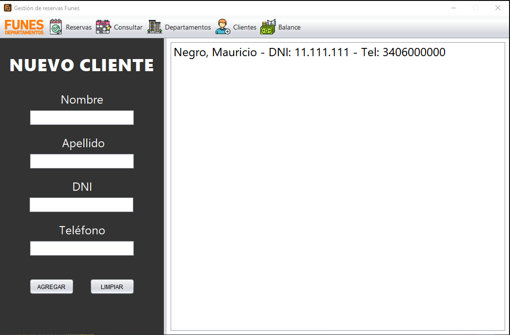
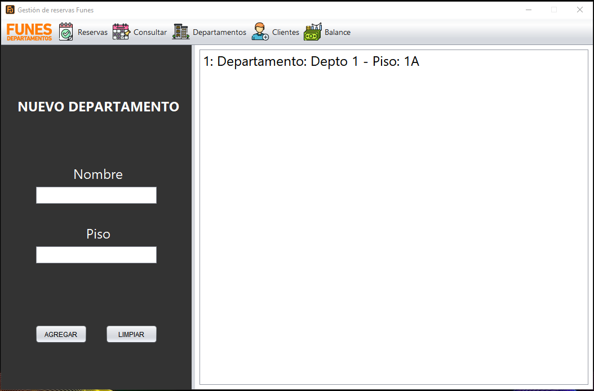
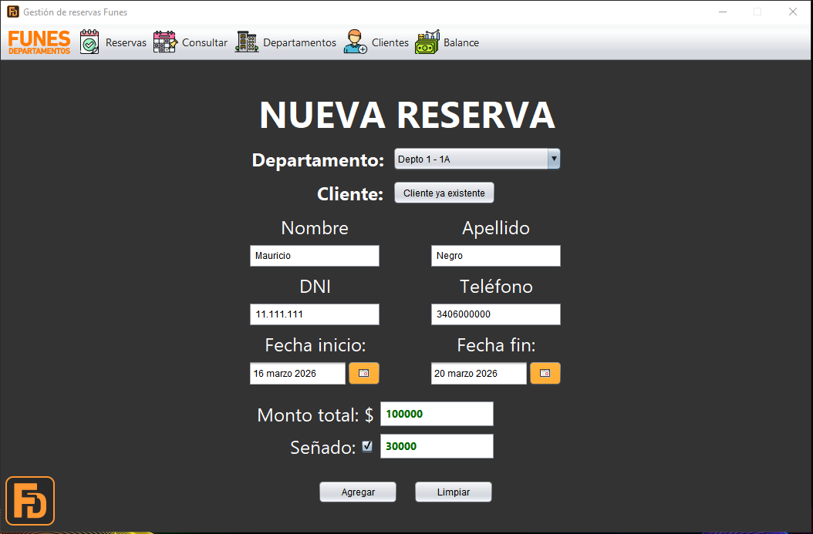
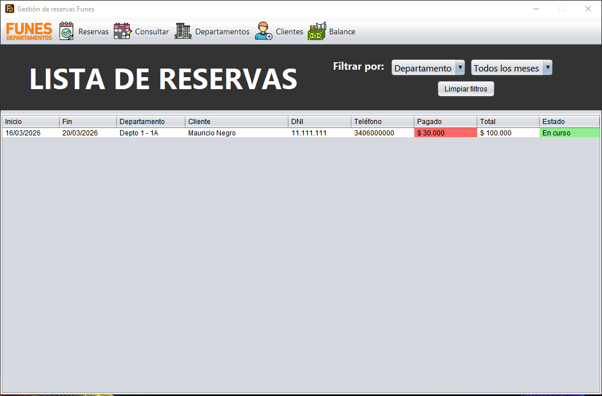
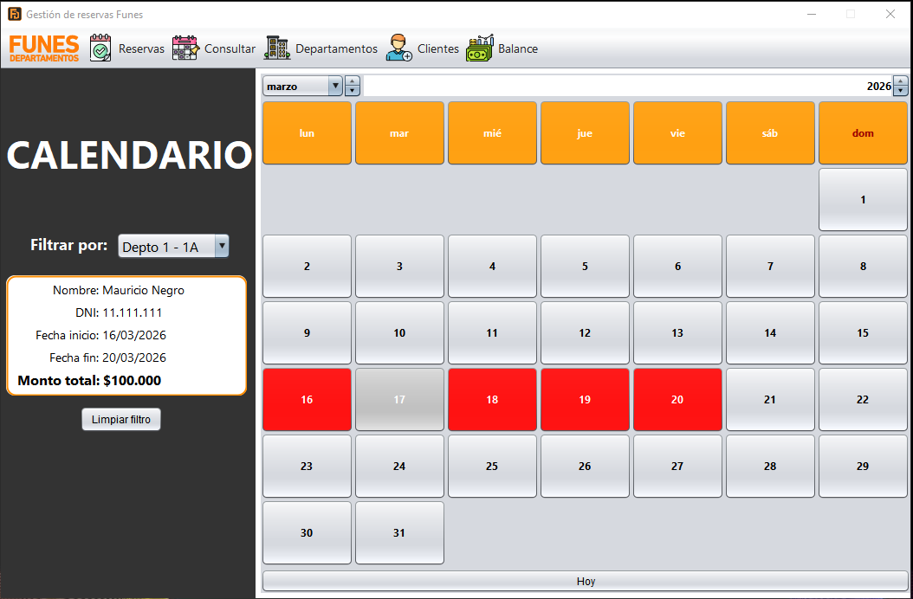
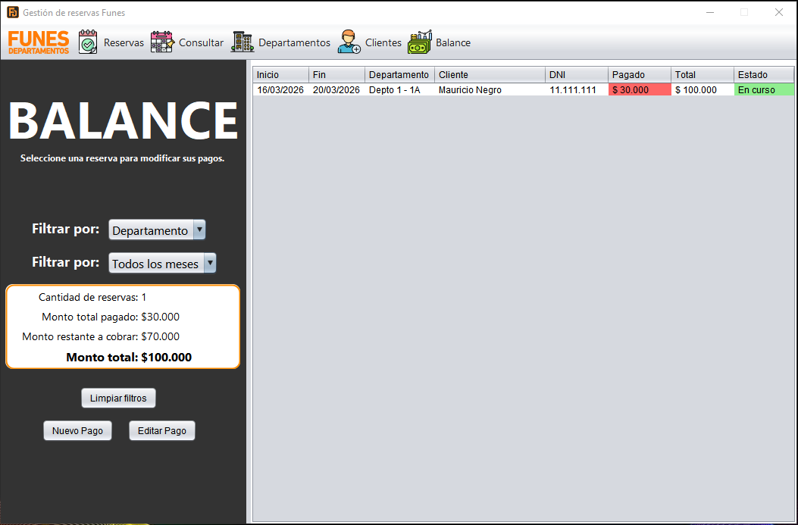
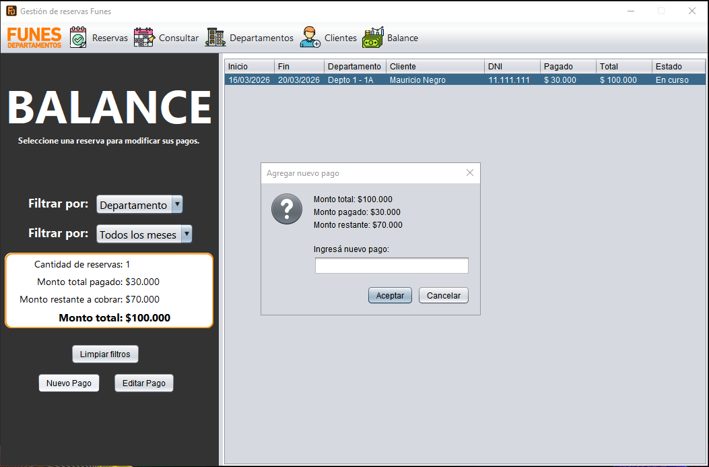

# Funes Departamentos - Gestion de alojamientos

  
  
  
  
  

Sistema de gestión de alojamientos desarrollado para la administración de reservas, clientes y departamentos, con control de disponibilidad y seguimiento de pagos.

---

## Descripción

Este sistema fue desarrollado como solución para un cliente real que necesitaba organizar la gestión de sus departamentos, ya que llevaba el control de reservas de forma manual, lo que generaba conflictos en la asignación de fechas.

La aplicación permite centralizar toda la información en una única interfaz, facilitando la carga, consulta y control de reservas, evitando superposiciones y mejorando la gestión general.

---

## Funcionalidades

- ✔️ ABM de clientes  
- ✔️ ABM de departamentos  
- ✔️ Registro y edición de reservas  
- ✔️ Control de disponibilidad por fechas  
- ✔️ Vista de calendario por departamento  
- ✔️ Listado completo de reservas con filtros  
- ✔️ Gestión de pagos (señas y saldo restante)  
- ✔️ Balance general de reservas  

---

## Tecnologías

Este sistema fue desarrollado en:

- **Java** (aplicación de escritorio)  
- **SQLite** (base de datos local)

La utilización de SQLite permite que la aplicación funcione de manera completamente local en la computadora del cliente, sin necesidad de conexión a internet ni configuraciones adicionales.

---

## Capturas del sistema

### Pantalla principal

---

### Gestión de clientes

---

### Gestión de departamentos

---

### Nueva reserva

---

### Lista de reservas

---

### Calendario de ocupación

---

### Balance de reservas

---

### Registro de pagos

---

## 📌 Notas

- El sistema permite editar clientes, departamentos y reservas existentes.  
- Se pueden registrar múltiples pagos por reserva para llevar un control del saldo pendiente.  
- La visualización tipo calendario permite identificar rápidamente la ocupación de cada departamento.  

---

## Estado del proyecto

✔️ Aplicación funcional desarrollada para uso real en la gestión de reservas de alojamientos.
